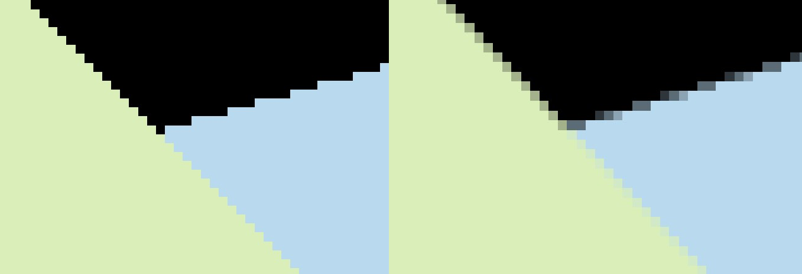

# GAMES101 - Assignment2

作业完成的得分点：

*  [5 分] 正确地提交所有必须的文件，且代码能够编译运行。
*  [20 分] 正确实现三角形栅格化算法。
*  [10 分] 正确测试点是否在三角形内。
*  [10 分] 正确实现 z-buffer 算法, 将三角形按顺序画在屏幕上，图像存至image.png。
*  [提高项 5 分] 用 super-sampling 处理 Anti-aliasing，图像存至image-SSAA.png。

基础得分点说明：

* 在函数void rasterize_triangle()中实现三角形栅格化算法和z-buffer算法。
* 在函数bool insideTriangle()中测试点是否在三角形内。

提高项说明：

* 修改rasterizer.hpp：
*  在rasterizer类定义中添加 `std::vector<Eigen::Vector3f> color_buf;`
* 修改rasterizer.cpp：
*  使用一个布尔变量SSAA来选择启用SSAA；
  * 在rasterizer类的构造函数中将depth_buf和color_buf扩容至4倍；
* 在函数clear()中添加清除color_buf的语句；
  * 在函数rasterize_triangle()对每个像素点进行四次采样，依次对每个采样点进行insideTriangle检测和深度检测，对通过两个检测的采样点，更新depth_buf和color_buf，并计数；
四次采样完成后，若有通过检测的采样点，则对四个采样点的color_buf求均值，更新像素点颜色。

* SSAA处理前后细节对比：

​		左：未使用SSAA       右：使用SSAA	