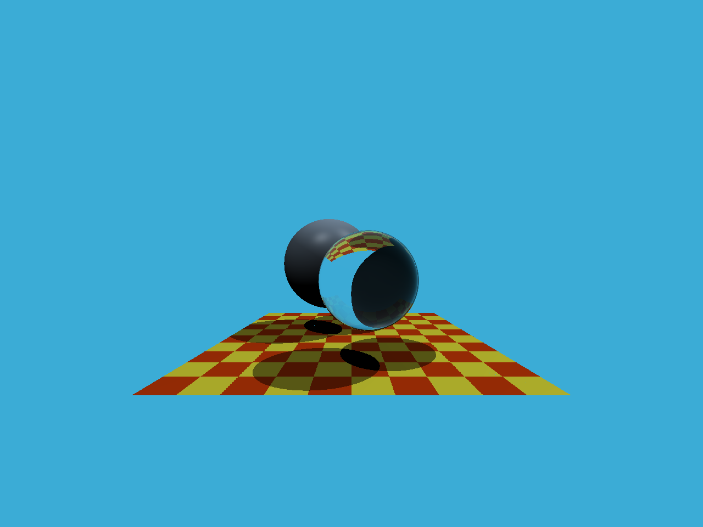

# GAMES101 - Assignment5

**作业完成的得分点**：

*   [5 分] 提交的格式正确，包含所有必须的文件。代码可以编译和运行。
*   [10 分] 光线生成： 正确实现光线生成部分，并且能够看到图像中的两个球体。
*   [15 分] 光线与三角形相交： 正确实现了 Moller-Trumbore 算法，并且能够看到图像中的地面。

**函数说明**：

* Render() : 为每个像素生成一条对应的光线，然后调用函数 castRay() 来得到颜色，最后将颜色存储在帧缓冲区的相应像素中。
*  rayTriangleIntersect() : 使用 Moller-Trumbore 算法，更新 tnear, u, v 三个参数。

**结果展示**：

