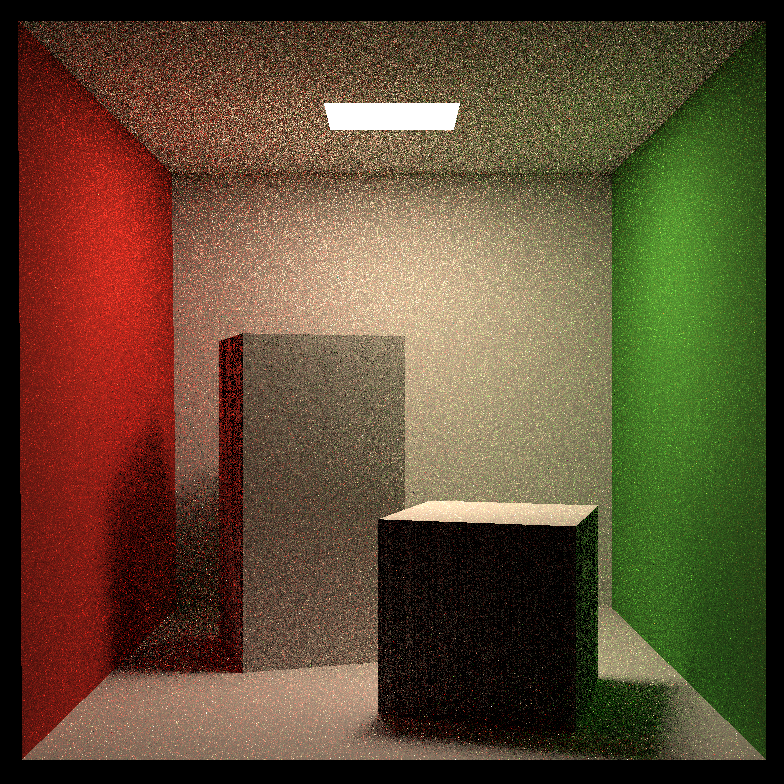

# GAMES101 - Assignment7

**作业完成的得分点**：

*   [5 points] 提交格式正确，包含所有需要的文件；代码可以在虚拟机下正确 编译运行。
*   [45 points] Path Tracing：正确实现 Path Tracing 算法，并提交分辨率 不小于 512*512，采样数不小于 8 的渲染结果图片。

**结果展示**：

分辨率：512 * 512，采样数：8，运行时间：29 min

