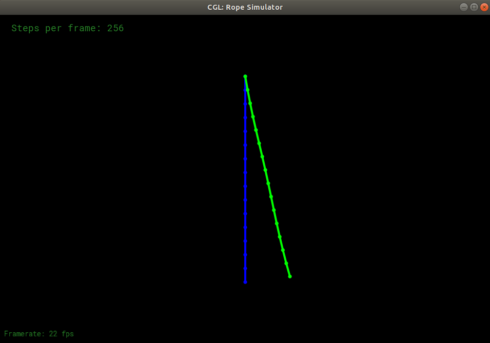

# GAMES101 - Assignment8

**作业完成的得分点**：

*   [5 分] 提交的格式正确，包含所有必须的文件。代码可以编译和运行。
*   [5 分] 连接绳子约束，正确地构造绳子
*   [5 分] 半隐式欧拉法
*   [5 分] 显式欧拉法
*   [10 分] 显式 Verlet
*   [5 分] 阻尼

**函数说明**：

* Rope::rope(...)：构造Mass对象，根据参数设置质量和固定属性；构造弹簧对象，根据参数设置设置弹簧节点索引和弹簧系数k。
*  void Rope::simulateEuler(...)：实现显式、半隐式欧拉法，设置阻尼。
*  void Rope::simulateVerlet(...)：实现显式Verlet方法，设置阻尼。

**结果展示**：

构造绳子

显式欧拉（蓝）

半隐式欧拉（蓝）

带阻尼的显式Verlet（绿）

