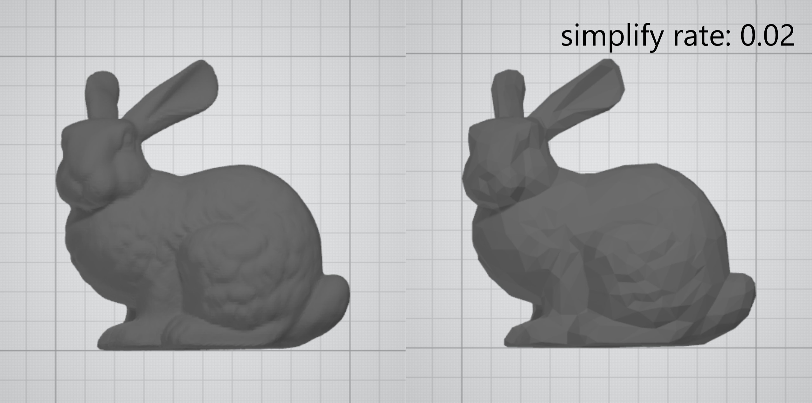
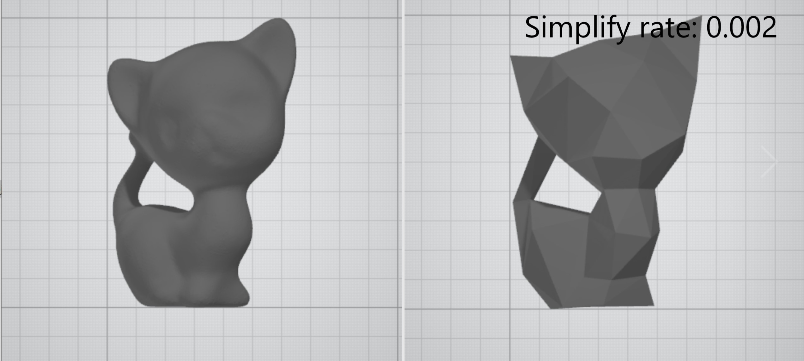
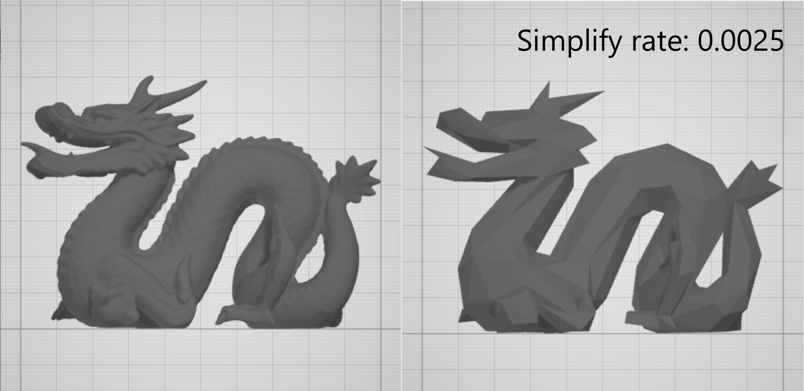

# GAMES101 - Final_Project

## 选题

>**2.1.2 网格简化及重新网格化**
>
>有时，三角形网格中的三角形数量远远超过所需要的，从而浪费了存储空间，并且会花费很多的计算时间。为了解决这个问题，我们可以简化网格，在其中找到可以使用较少三角形的区域，然后相应地简化这些区域。另外，还可以找到同一表面更好的离散表示。将网格转换为更好的表示形式称为重新网格化。

## 项目简介

本项目编写了一个简单的网格简化程序，可读取OBJ模型文件，并按照指定的简化率对其进行网格简化，将结果存至新的OBJ模型文件中。

**注：** 由于时间关系，重新网格化的部分未完成。

## 构建与运行

```
cd ./codes
mkdir build
cd build
cmake ..
make
./MeshSimplify [Input Model File] [Output Model File] [Simplify Rate]
```

## 结果展示







## 实现说明

/codes目录下存放了项目的完整代码及可供测试的OBJ模型文件，各代码文件功能如下：

* global.hpp : 存放全局变量
* vector.hpp : 定义三维/四维向量，重载运算符，实现常用的向量运算
* matrix.hpp : 定义矩阵，实现常用的矩阵运算
* model.hpp :  读写OBJ模型文件，使用edge-collapse algorithm（边坍塌算法）对网格进行简化
* main.cpp : 程序入口，输出提示信息

## 参考

* GitHub: [leix28 - Mesh-Simplify](https://github.com/leix28/Mesh-Simplify)

- Essay: [Garland M., Heckbert P S., Surface simplification using quadric error matrix, Computer Graphics, 1997, 209-216.](reference/Surface Simplification Using Quadric Error Metrics_BY_Garland&Heckbert.pdf)

